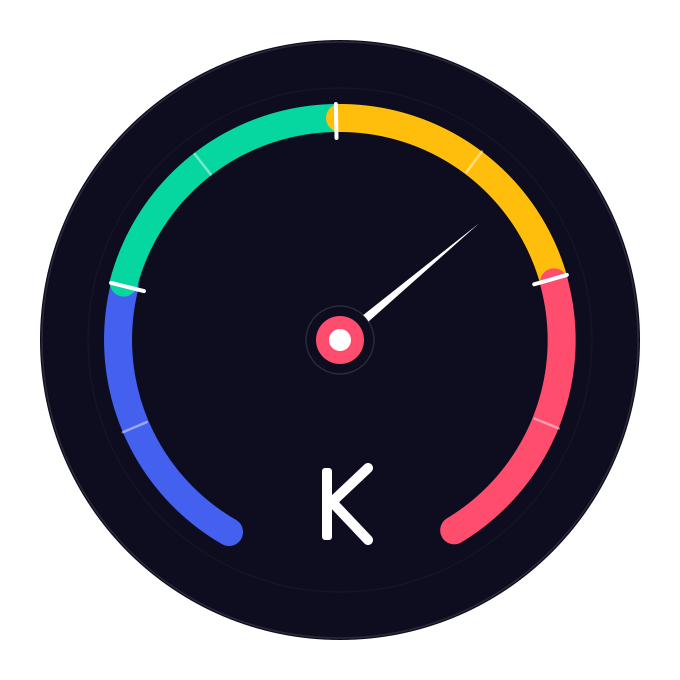
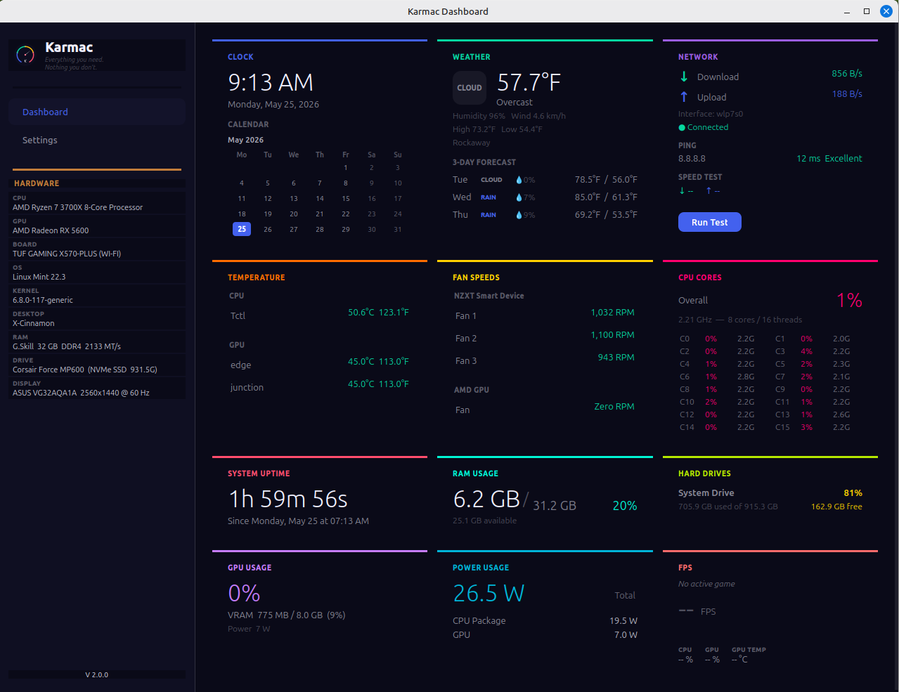

# Karmac Dashboard

> **Everything you need. Nothing you don't.**

Karmac is a free and open source desktop dashboard for Linux. It gives everyday users a beautiful, organized view of their system and personal information — without requiring any technical knowledge to set up or use.





---

## Features

**Row 1 — Personal & Connectivity**
- 🕐 **Clock, Date & Calendar** — Time, date, and mini calendar with today highlighted
- 🌤 **Weather** — Current conditions, high/low, 3-day forecast (Open-Meteo, no API key required)
- 🌐 **Network** — Live speeds, ping/latency, and internet speed test

**Row 2 — Thermal & Processing**
- 🌡 **Temperature** — CPU and GPU temps in Celsius, Fahrenheit, or both
- 💨 **Fan Speeds** — RPM readings grouped by chip with Zero RPM detection
- ⚡ **CPU Cores** — Overall usage, per-core activity, and per-core frequency

**Row 3 — Memory & Storage**
- ⏱ **System Uptime** — Time since last boot
- 💾 **RAM Usage** — Used/available memory in real time
- 💿 **Hard Drives** — Space used/free for all detected drives

**Row 4 — Power & Graphics**
- 🎮 **GPU Usage** — AMD GPU load, VRAM usage, and power draw
- ⚡ **Power Usage** — CPU and GPU power consumption in watts
- 🎯 **FPS** — Live FPS and gaming stats via MangoHud

**Sidebar**
- Full hardware info: CPU, GPU, RAM, storage, OS, kernel, desktop environment, and display details

**Full Settings System**
- Theme, font size, panel toggles, timezone, fan labels, RPM thresholds, temperature format, drive visibility, ping host, and more

---

## Requirements

- Linux (any modern distribution)
- Python 3.10 or higher
- AMD or Intel CPU (for power/temperature monitoring)

---

## Installation

### Step 1 — Install system dependencies

```
sudo apt install libxcb-cursor0 lm-sensors nvme-cli librsvg2-bin mangohud
```

### Step 2 — Clone the repository

```
git clone https://gitlab.com/team.karmac1/Karmac-dashboard.git
cd Karmac-dashboard
```

### Step 3 — Create a virtual environment

```
python3 -m venv ~/karmac-env
source ~/karmac-env/bin/activate
```

### Step 4 — Install Python dependencies

```
pip install -r SRC/requirements.txt
```

### Step 5 — Run Karmac

```
cd SRC
python3 main.py
```

---

## Optional Configuration

### RAM Details (manufacturer, speed, type)

Karmac reads RAM details using `dmidecode`. To allow this without a password prompt, run:

```
sudo visudo
```

Add this line at the bottom (replace `YOUR_USERNAME`):

```
YOUR_USERNAME ALL=(ALL) NOPASSWD: /usr/sbin/dmidecode
```

### CPU Power Monitoring (RAPL)

To enable CPU power readings without root access, create a udev rule:

```
sudo nano /etc/udev/rules.d/99-rapl.rules
```

Add these lines:

```
SUBSYSTEM=="powercap", KERNEL=="intel-rapl:0", ACTION=="add", RUN+="/bin/chmod a+r /sys/class/powercap/intel-rapl:0/energy_uj"
SUBSYSTEM=="powercap", KERNEL=="intel-rapl:0:0", ACTION=="add", RUN+="/bin/chmod a+r /sys/class/powercap/intel-rapl:0:0/energy_uj"
```

Then apply immediately:

```
sudo chmod a+r /sys/class/powercap/intel-rapl:0/energy_uj
sudo chmod a+r /sys/class/powercap/intel-rapl:0:0/energy_uj
```

### FPS Monitoring (MangoHud)

Karmac reads live FPS data from MangoHud log files. First create a MangoHud config:

```
mkdir -p ~/.config/MangoHud
nano ~/.config/MangoHud/MangoHud.conf
```

Add:

```
output_folder=/home/YOUR_USERNAME/.local/share/MangoHud
log_interval=100
fps
gpu_stats
cpu_stats
ram
autostart_log=1
```

**For Steam games**, add `mangohud %command%` to each game's launch options in Steam. Karmac will automatically detect when a game is running and display live FPS data.

---

## Desktop Launcher

### Create the app icon

```
rsvg-convert -w 128 -h 128 ~/Karmac-dashboard/Assets/Karmac_Logo.svg -o ~/.local/share/icons/Karmac_Logo.png
```

### Create the launcher

```
nano ~/.local/share/applications/karmac.desktop
```

Paste the following, replacing `YOUR_USERNAME`:

```
[Desktop Entry]
Type=Application
Name=Karmac Dashboard
Comment=Everything you need. Nothing you don't.
Exec=bash -c 'source /home/YOUR_USERNAME/karmac-env/bin/activate && python3 /home/YOUR_USERNAME/Karmac-dashboard/SRC/main.py'
Icon=/home/YOUR_USERNAME/.local/share/icons/Karmac_Logo.png
Categories=Utility;System;
Terminal=false
StartupNotify=true
```

### Create a desktop shortcut

```
cp ~/.local/share/applications/karmac.desktop ~/Desktop/
chmod +x ~/Desktop/karmac.desktop
gio set ~/Desktop/karmac.desktop metadata::trusted true
```

---

## Privacy

Karmac is designed to be as privacy-focused as possible. Here is a complete list of every outbound connection Karmac makes:

| Service | What is sent | When | Who receives it |
|---------|-------------|------|-----------------|
| Open-Meteo | Your latitude/longitude | Every 10 minutes when weather is configured | Open-Meteo (FOSS, EU-based, no tracking, no account required) |
| Quad9 DNS (9.9.9.9) | A tiny ping packet | Every 5 seconds | Quad9 (non-profit, privacy-focused DNS) — configurable in Settings |
| Ookla (speedtest.net) | Your IP address and connection speed | Only when you click "Run Test" | Ookla/Ziff Davis — see their privacy policy |

**Everything else is 100% local:**
- All hardware monitoring reads from `/proc`, `/sys`, and local system tools
- FPS data comes from local MangoHud log files
- Network traffic monitoring is done locally via nethogs
- Settings are stored locally in `~/.config/karmac/`
- No telemetry, no analytics, no crash reporting to external servers

You can change the ping host to any server you prefer in Settings. You can also disable the speed test entirely by disabling the Network panel.

---

## Troubleshooting

If Karmac crashes, check the log file:

```
cat ~/.config/karmac/karmac.log
```

---

## Roadmap

### v4 Considerations
- **Shared metrics service** — centralized data collection with panels subscribing to a shared cache rather than polling independently. Improves efficiency on lower-powered hardware as the panel count grows
- **Plugin/widget framework** — allow community contributors to create custom panels without modifying core code
- **Theme marketplace** — share and download community-created themes
- **Additional screenshots** — light theme, gaming mode, settings page
- **"Why Karmac?" comparison** — help visitors understand the value proposition immediately
- **AppImage packaging** — alternative to Flatpak for broader distro support
- **AUR package** — for Arch/Manjaro users
- **Battery status** — for laptop users
- **Multi-monitor support** — different dashboards on different screens

---

## Contributing

Karmac is built in the open and contributions are very welcome! Whether you're a developer, designer, translator, or tester — there's a place for you.

See [CONTRIBUTING.md](CONTRIBUTING.md) for details on how to get involved.

---

## License

Karmac is licensed under the [GNU General Public License v3.0](LICENSE).

---

## Made by Team Karmac